# Práctica 2.2: Autenticación en Nginx (Docker)
**Alumno:** Mario Luna López

Este documento detalla el proceso de configuración de seguridad y autenticación básica en un servidor Nginx, desplegado sobre un contenedor Docker.

---

## 1. Preparación 

### 1.1. Gestión de Ramas (Git)
Para mantener un flujo de trabajo ordenado, iniciamos el desarrollo creando una rama específica para esta práctica.
* Comando: `git checkout -b mario-nginx`

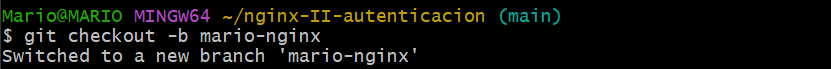

### 1.2. Verificación del Servidor Web
Al trabajar con contenedores, la verificación del servicio se realiza comprobando el estado del contenedor. Verificamos que el contenedor está levantado y escuchando puertos:`docker ps`.

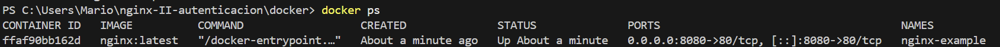

---

## 2. Creación de Usuarios y Contraseñas

Para habilitar la autenticación, necesito un archivo .htpasswd con las credenciales encriptadas.

### 2.1. Decargar la herramienta
* Comando: `docker pull stakater/ssl-certs-generator`

### 2.2. Generación del archivo htpasswd

He generado el hash para mi usuario "mario" y posteriormente he repetido el proceso para el usuario "luna"

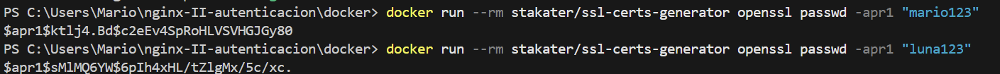

### 2.3. Edición del archivo

He creado manualmente el archivo conf/htpasswd pegando los hashes generados para tener dos usuarios válidos:

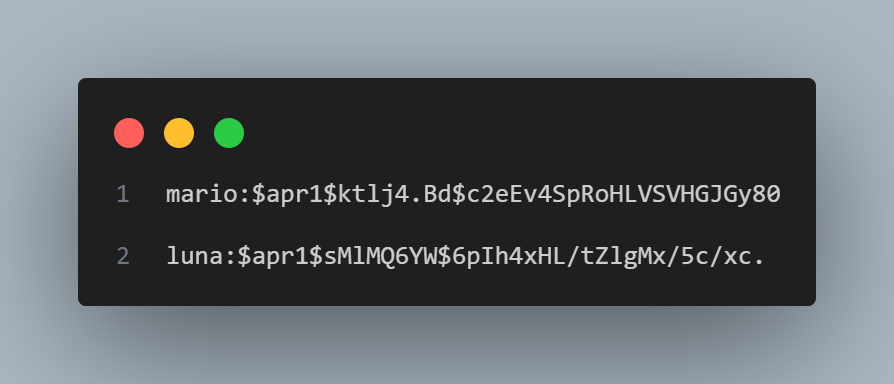

---

## 3. Configuración de Nginx

He procedido a configurar el servidor creando mi propio archivo .conf para definir las reglas de acceso.

### 3.1. Archivo conf/mario.test.conf

He configurado el bloque server para proteger todo el directorio raíz con contraseña

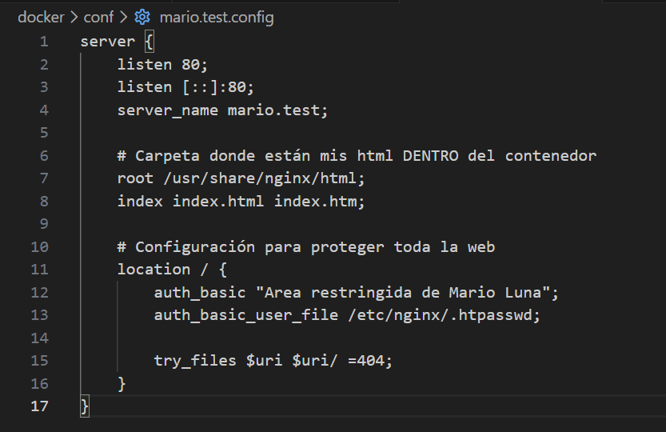

### 3.2. Despliegue del contenedor:

He levantado el contenedor, al que he llamado docker, montando los volúmenes necesarios para vincular mis archivos locales.

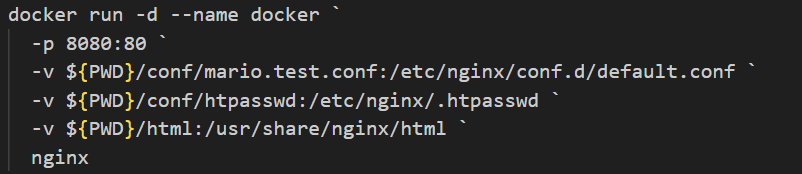

### Prueba: 

Al acceder a http://localhost:8080, el navegador me solicita unos credenciales para acceder

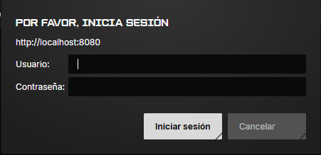

 > Ahora ingresaremos los creedecniales correcto usuario 'mario' contraseña 'mario123'

 

---

## 4 Tareas

### 4.1. Análisis de Logs (Tarea 2.1)

He realizado pruebas de acceso para verificar que los eventos quedan registrados.

 #### 1. Intenté entrar con un usuario inválido.

 #### 2. Accedí correctamente con mi usuario "luna".

Para ver estos registros ejecute:
* Comando: `docker logs nginx-mario`

 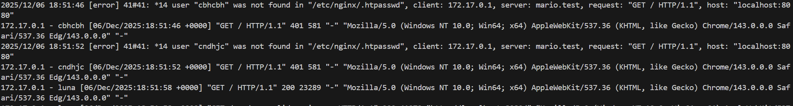

**Resultados:** En los logs he podido identificar el error 'user not found' del intento fallido y el código exitoso del acceso con usuario existente

### 4.2. Protección Específica (Tarea 2.2)

Siguiendo los requisitos, he modificado la configuración para que la portada sea pública y solo la sección de contacto requiera contraseña.

#### 1. Edición de conf/mario.test.conf

He separado la configuración en dos bloques:

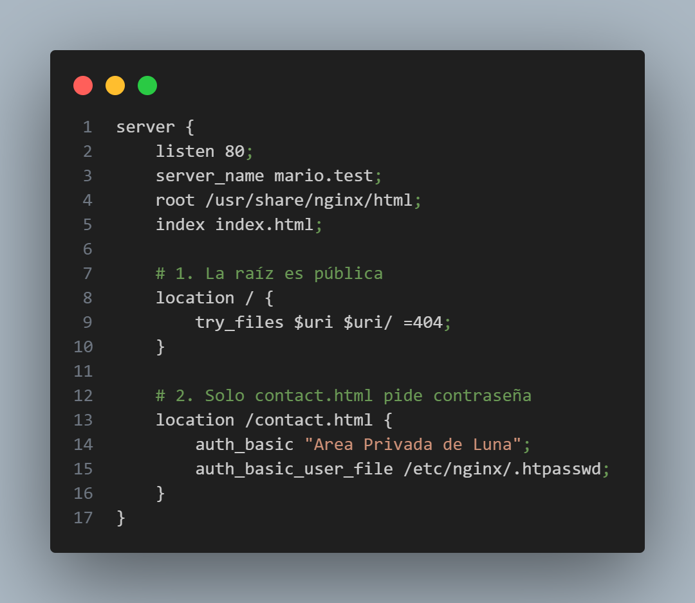

#### 2. Aplicación de cambios

He reiniciado el contenedor para aplicar la nueva configuración:

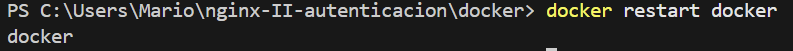

Ahora al meterme el contact me pide los creedenciales

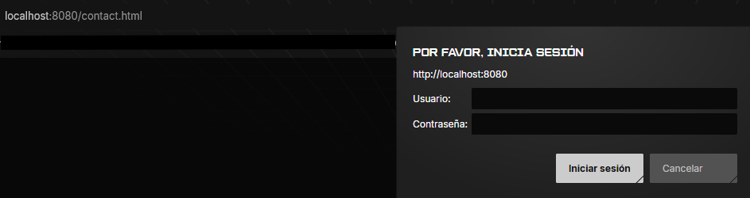

---

## 5 Restriccion por IP

Finalmente, he implementado seguridad basada en la dirección IP. Primero identifiqué mi IP en los logs (ej: 172.17.0.1)

### 5.1. Bloqueo de IP (Tarea 3.1)

He configurado Nginx para denegar el acceso a mi propia IP y permitir el resto, comprobando que recibo un error 403 Forbidden

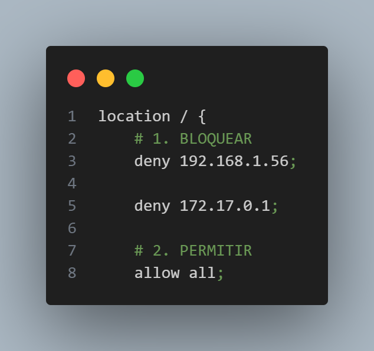

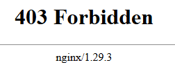

### 5.2. Combinación IP + Usuario (Tarea 3.2)

Para la configuración final, he utilizado la directiva satisfy all, obligando a cumplir ambas condiciones: tener la IP permitida Y tener usuario/contraseña.

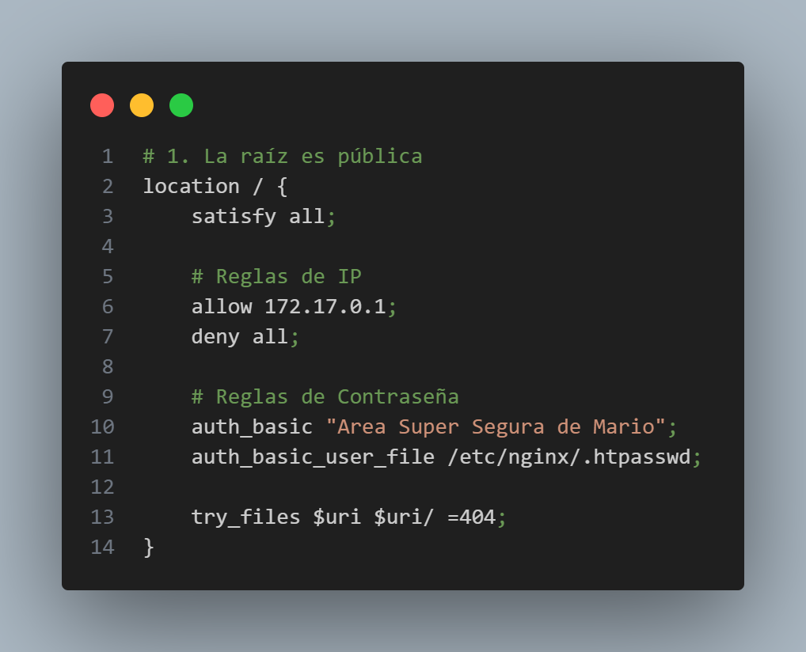

**Resultados:** Con esta configuración, he verificado que solo puedo acceder si me conecto desde la IP autorizada y además introduzco mis credenciales correctamente

