# Práctica 2.2: Autenticación en Nginx (Parte Servidor)
**Alumno:** David Martínez Alcázar

Este documento detalla el proceso de configuración de seguridad y autenticación básica en un servidor Nginx, desplegado sobre una máquina virtual Vagrant/Debian.

---

## 1. Preparación del Entorno

### 1.1. Gestión de Ramas (Git)
Para mantener un flujo de trabajo ordenado, iniciamos el desarrollo creando una rama específica para esta práctica.
* Comando: `git checkout -b david-nginx`

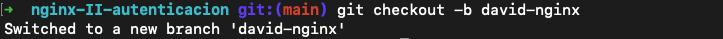

### 1.2. Verificación del Servidor Web
Tras aprovisionar la máquina virtual e instalar Nginx, verificamos que el servicio está activo y funcionando correctamente mediante `systemctl status nginx`.

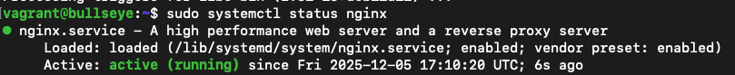

---

## 2. Gestión de Usuarios y Contraseñas
Para habilitar la autenticación básica (`Basic Auth`), generamos un archivo de credenciales oculto en `/etc/nginx/.htpasswd`. Utilizamos `openssl` con cifrado MD5 para garantizar que las contraseñas no se guarden en texto plano.

**Usuarios creados:** `david` y `martinez`.

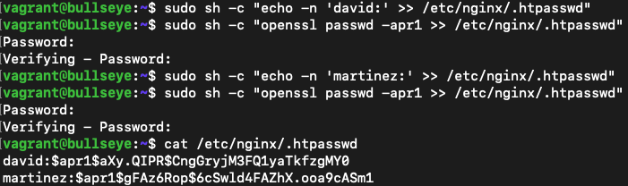

---

## 3. Validación de la Configuración
Antes de aplicar cualquier cambio de seguridad en el archivo del virtual host (`/etc/nginx/sites-available/default`), es fundamental verificar que la sintaxis de la configuración de Nginx sea correcta para evitar caídas del servicio.

* Comando: `sudo nginx -t`

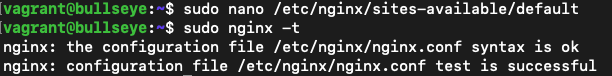

---

## 4. Pruebas de Acceso y Logs (Autenticación Global)
Configuramos inicialmente el bloque `location /` para requerir autenticación en todo el sitio web.

### 4.1. Verificación en Navegador
Al intentar acceder a la IP del servidor web, el navegador solicita credenciales.

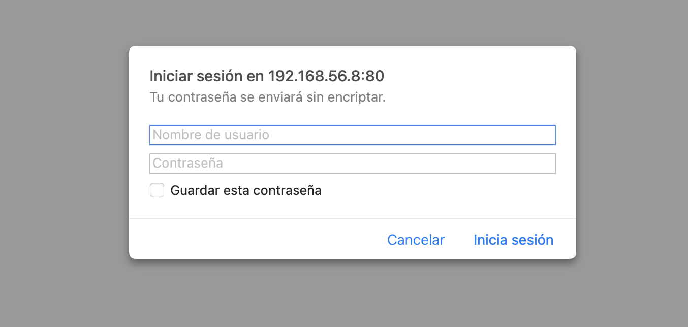

* **Intento Fallido:** Si cancelamos o introducimos datos incorrectos, el servidor devuelve un error **401 Authorization Required**.

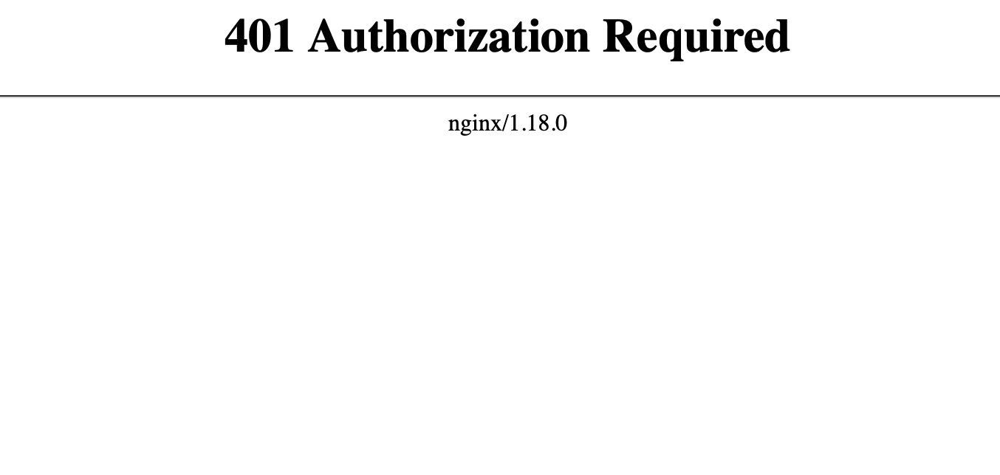

* **Acceso Exitoso:** Al introducir las credenciales válidas, accedemos a la portada de "Perfect Learn".

### 4.2. Análisis de Logs
Inspeccionamos los registros de Nginx para confirmar los eventos de acceso. Se observan intentos fallidos (código **401** y errores de "password mismatch") seguidos de accesos exitosos (código **200**).

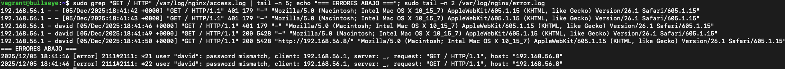

---

## 5. Protección Selectiva de Recursos
Modificamos la configuración para que el sitio sea público por defecto, protegiendo **únicamente** la sección de contacto (`/contact.html`).

**Pruebas:**
1.  **Home (Pública):** La página de inicio carga directamente sin solicitar contraseña.
    

2.  **Contacto (Privada):** Al navegar específicamente a la sección "Contact Us", salta la ventana de autenticación.
    

### 5.1. Detalle de la Configuración Selectiva
Para lograr el comportamiento mostrado anteriormente (donde solo se pide contraseña en "Contacto"), hemos modificado el archivo `/etc/nginx/sites-available/default`.

Como se ve en el código:
* En el bloque raíz `location /`, las directivas `auth_basic` están comentadas (desactivadas).
* Hemos creado un bloque específico `location /contact.html` donde sí activamos `auth_basic`.

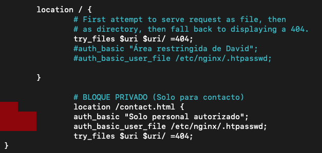

---

## 6. Restricción de Acceso por IP (Tarea 3.1)
Para aumentar la seguridad, configuramos Nginx para denegar peticiones provenientes de direcciones IP específicas. En este caso, simulamos un bloqueo a la IP de la máquina anfitriona (`192.168.56.1`) para probar la directiva `deny`.

**Configuración:**
Añadimos la directiva `deny` dentro del bloque `location /`.

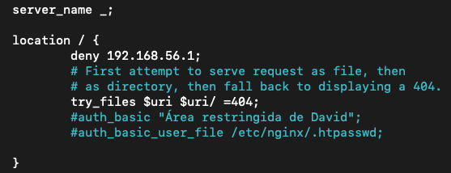

### 6.1. Comprobación del Bloqueo
Tras recargar el servicio Nginx (`sudo systemctl reload nginx`), intentamos acceder desde el navegador de la máquina cuya IP ha sido bloqueada.
* **Resultado:** El servidor rechaza la conexión inmediatamente mostrando un error **403 Forbidden**.

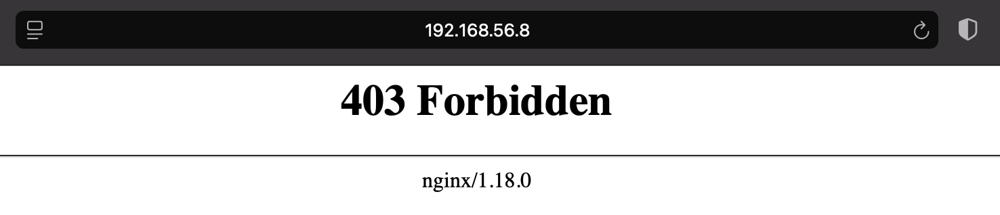

### 6.2. Evidencia en Logs
Consultamos el archivo `error.log` para confirmar que el bloqueo se debe a la regla configurada. El mensaje `access forbidden by rule` confirma que el firewall de aplicación está funcionando correctamente.

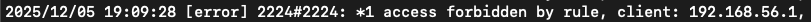

---

## 7. Seguridad Avanzada y Verificación Final
Como paso final de endurecimiento del servidor (*hardening*), hemos configurado una política de seguridad estricta utilizando la directiva `satisfy all`.

**Configuración aplicada (`satisfy all`):**
Esta directiva obliga al cliente a cumplir **TODAS** las condiciones de seguridad impuestas, no solo una de ellas.
1.  **Restricción de IP:** Solo permitimos el acceso desde la IP `192.168.56.1`.
2.  **Autenticación:** Además de venir de la IP correcta, el usuario *también* debe introducir la contraseña correcta.

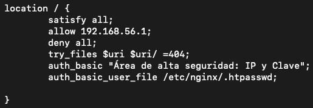

**Resultado Final:**
Tras aplicar todas las capas de seguridad y reiniciar el servicio, verificamos que la plataforma "Perfect Learn" carga correctamente y es accesible cumpliendo los requisitos establecidos.

